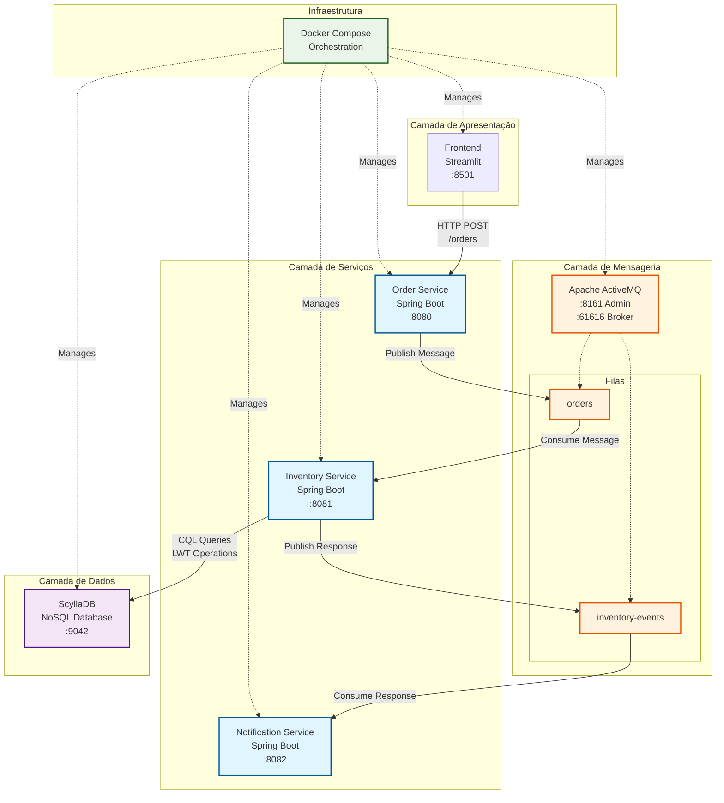
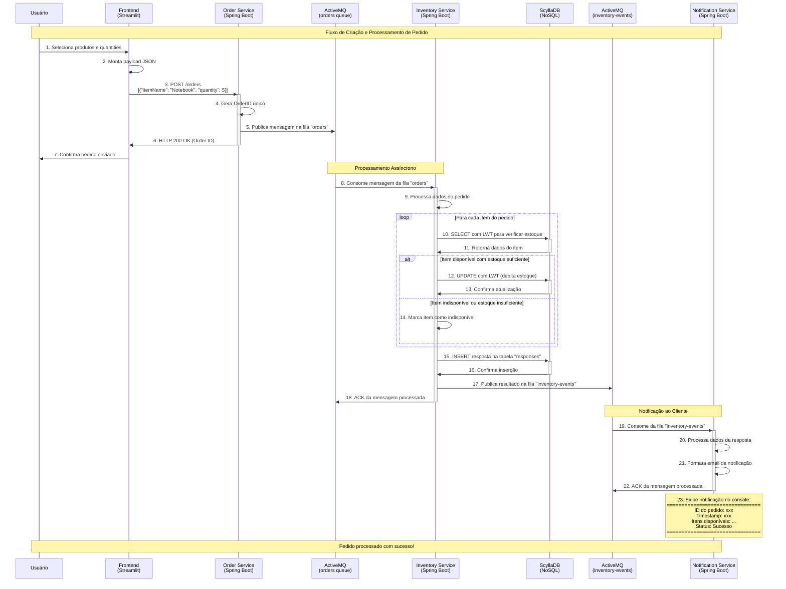

# Estrutura do Repositório

* #### 📁 [`atividades`](https://github.com/mentejoao/scd_2025_01/tree/main/atividades): tarefas relacionadas a disciplina
* #### 📁 [`projeto_pratico`](https://github.com/mentejoao/scd_2025_01/tree/main/projeto_pratico): projeto final da disciplina

## Projeto Prático
```
Integrantes:

João Gabriel Cavalcante França - 202201695
Joseppe Pedro Cunha Fellini - 202300194
Mauro Sérgio do Nascimento Junior - 202204842
```
## 📁 Estrutura do Projeto Prático

```
projeto_pratico/
├── docker-compose.yml          # Orchestração dos containers
├── init/
│   └── init.cql               # Script de inicialização do ScyllaDB
├── frontend-orders/           # Interface web (Streamlit)
├── OrderService/              # Microserviço de pedidos (Spring Boot)
├── InventoryService/          # Microserviço de estoque (Spring Boot)
└── NotificationService/       # Microserviço de notificações (Spring Boot)
```

## Como Executar o Projeto

### Pré-requisitos
- Docker & Docker Compose

### Execução
```bash
# Clone o repositório (se necessário)
git clone https://github.com/mentejoao/scd_2025_01
cd projeto_pratico

# Execute todos os serviços
docker compose up --build
```

### Portas dos Serviços
- **Frontend**: http://localhost:8501
- **Order Service**: http://localhost:8080
- **Inventory Service**: http://localhost:8081  
- **Notification Service**: http://localhost:8082
- **ActiveMQ Admin**: http://localhost:8161 (admin/admin)
- **ScyllaDB**: localhost:9042

## Diagrama de Componentes

O sistema é composto por 6 componentes principais organizados em uma arquitetura de microserviços:



### Componentes:

1. **Frontend (Python/Streamlit)**: Interface web para visualização de produtos e criação de pedidos
2. **Order Service (Java/Spring Boot)**: Recebe pedidos via HTTP POST e publica na fila do ActiveMQ
3. **ActiveMQ**: Message broker que gerencia duas filas:
   - `orders`: Conecta Order Service ao Inventory Service
   - `inventory-events`: Conecta Inventory Service ao Notification Service
4. **Inventory Service (Java/Spring Boot)**: Processa pedidos, verifica/atualiza estoque no banco
5. **ScyllaDB**: Banco de dados NoSQL (compatível com Cassandra) com suporte a LWT (Lightweight Transactions)
6. **Notification Service (Java/Spring Boot)**: Envia notificações simuladas via console


## Fluxo de Funcionamento

### 1. Criação de Pedido
O frontend envia um POST para `/orders` no Order Service com o payload:
```json
[
    {
        "itemName": "nome-do-item",
        "quantity": 5
    }
]
```

### 2. Processamento do Pedido
1. **Order Service** recebe a requisição e publica uma mensagem na fila `orders`
2. **Inventory Service** consome a mensagem da fila `orders`
3. Verifica no **ScyllaDB** se os itens existem e têm quantidade suficiente
4. Utiliza **LWT (Lightweight Transactions)** para atualizações seguras em ambiente concorrente
5. Atualiza o estoque no banco de dados
6. Publica resultado na fila `inventory-events`

### 3. Notificação
**Notification Service** consome da fila `inventory-events` e exibe no console:

```
================================== Início E-mail ==================================

ID do pedido: e6f6ab5e-cdd0-4593-ae98-4180d8f06b48

Timestamp: 25-06-2025 01:31:35

Itens disponíveis:
	Nome do item: Notebook
	Descrição: Notebook com 16GB RAM e SSD 512GB
	Quantidade atualmente em estoque: 31

Status do pedido: Sucesso

================================== Final E-mail ==================================
```

## Diagrama de Sequência

O diagrama abaixo ilustra o fluxo completo de uma requisição de pedido no sistema:



## Estrutura do Banco de Dados (ScyllaDB)

### Tabela `itens`
```sql
CREATE TABLE itens (
    name TEXT PRIMARY KEY,
    description TEXT,
    quantity_stock INT
);
```

### Tabela `responses`
```sql
CREATE TABLE responses (
    orderID UUID PRIMARY KEY,
    timestamp timestamp,
    itens_disponiveis list<frozen<item_udt>>,
    itens_indisponiveis list<frozen<item_udt>>,
    itens_inexistentes list<text>,
    order_status TEXT
);
```

* O banco vem pré-populado com produtos como: Teclado, Mouse, Monitor, Notebook, Headset, Webcam, etc.

## Respostas
### Matriz de Rastreabilidade - Requisitos Funcionais
| RF | DESCRIÇÃO | FILE_PATH |
|---|---|---|
| RF-01 | Criar fila orders | [OrderService.java](https://github.com/mentejoao/scd_2025_01/blob/main/projeto_pratico/OrderService/src/main/java/com/messaging/order_service/services/OrderService.java#L45-L51) |
| RF-01 | Criar fila inventory-events | [InventoryCheckerService.java](https://github.com/mentejoao/scd_2025_01/blob/main/projeto_pratico/InventoryService/src/main/java/com/messaging/inventory_service/services/InventoryCheckerService.java#L173-L182) |
| RF-02 | Order-Service expõe uma REST API (POST /orders) que gera um UUID, timestamp e lista de itens | [OrderController.java](https://github.com/mentejoao/scd_2025_01/blob/main/projeto_pratico/OrderService/src/main/java/com/messaging/order_service/controllers/OrderController.java#L32-L41) |
| RF-03 | Inventory-Service processa mensagens em ordem e publica sucesso ou falha (sem estoque) | [InventoryCheckerService.java](https://github.com/mentejoao/scd_2025_01/blob/main/projeto_pratico/InventoryService/src/main/java/com/messaging/inventory_service/services/InventoryCheckerService.java) |
| RF-04 | Notification-Service registra no console a notificação enviada | [NotificationService.java](https://github.com/mentejoao/scd_2025_01/blob/main/projeto_pratico/NotificationService/src/main/java/com/messaging/notification/service/NotificationServiceApplication.java) |

### Requisitos Não Funcionais
#### 1. ```Escalabilidade – Explique como você poderia conseguir escalabilidade com o Broker utilizado?``` 
É necessário distribuir a carga entre múltiplas instâncias do broker e dos serviços consumidores, isto é, utilizar um cluster com vários ActiveMQs, garantindo que, se uma instância falhar, as demais continuem operando. Além disso, em vez de um único consumidor processando mensagens, é possível ter várias instâncias trabalhando em paralelo, aumentando a capacidade de processamento. A utilização de um pool de conexões também melhora o desempenho, mantendo conexões abertas e evitando o custo de abertura e fechamento constante.

#### 2. ```Tolerância à falha – O que significa? Explique uma situação de falha que poderia ocorrer e como o Broker poderia tratá-la.```
Tolerância à falha significa que um sistema é capaz de continuar funcionando mesmo quando ocorrem problemas em partes dele. Se o ActiveMQ estiver configurado em modo de cluster com failover, outro broker automaticamente assume a função do que caiu. Além disso, se os consumidores (serviços que recebem as mensagens) estiverem configurados com conexão de failover, eles tentarão se reconectar automaticamente a outro broker disponível, sem perder as mensagens. 

#### 3. ```Idempotência - Explique esse conceito e como fazer para garanti-lo.```
Idempotência é o conceito segundo o qual uma mesma operação pode ser executada várias vezes com o mesmo efeito da primeira execução. Em sistemas distribuídos (como filas com ActiveMQ), pode acontecer de uma mensagem ser reenviada - por exemplo, se o consumidor falhar logo após processar a mensagem, mas antes de confirmar o processamento. Nesse caso, o broker pode reenviar a mesma mensagem, e o serviço precisa estar preparado para não processar duas vezes algo que deveria acontecer só uma vez, como um pagamento ou a criação de um pedido.


